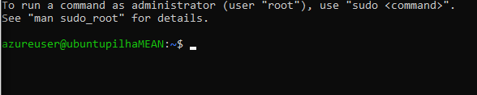
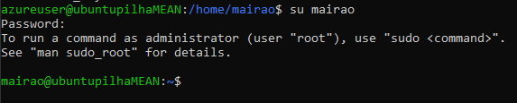
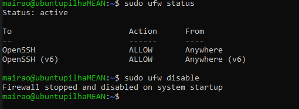
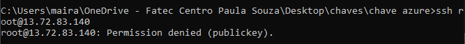
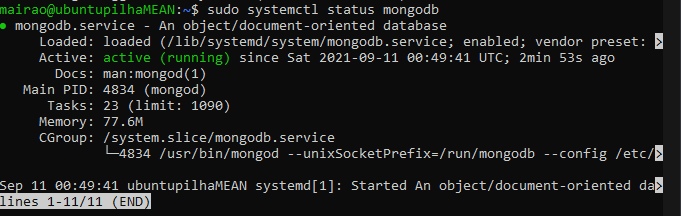
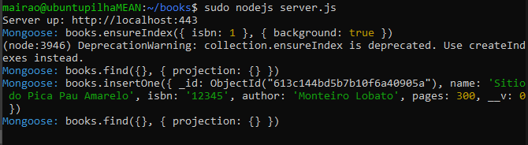
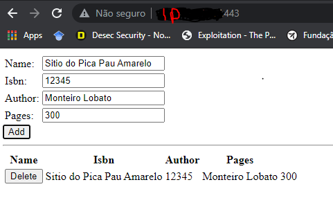

# Criação de um servidor ubuntu na Azure com instalação e configuração da pilha MEAN.
# Azure

A plataforma de nuvem Azure é composta por mais de 200 produtos e serviços em nuvem projetados para ajudá-lo a trazer novas soluções para a vida - para resolver os desafios de hoje e criar o futuro. Crie, execute e gerencie aplicativos em várias nuvens, no local e no perímetro, com as ferramentas e estruturas de sua escolha.
```html
https://azure.microsoft.com/en-us/overview/
```
## Azure criação da máquina ubuntu

Crie sua conta gratuita no azure, localize a opção **máquinas virtuais** clique em **criar** uma máquina virtual.

Depois selecione um **grupo de recursos** com o nome: **myResourceGroup**. Dê um nome a máquina, eu escolhi **ubuntupilhaMEAN**, selecione a região **(us) Leste dos EUA**, depois a imagem, escolha um **ubuntu Server 20.04**, selecione o tamanho **stantard_B1s - 1 vcpu, 1 Gib memória (R$ 37,19/mês)**

#### Configuração Chave pública.

Ainda na tela de criação da máquina, haverá um campo para definir se o login a máquina será por Chave Publica SSH ou por senha. É importante lembrar que com login por SSH, a conexão fica restrita a somente quem possui a chave configurada nesta parte conseguirá efetuar um login.

Selecione **Chave pública de SSH**.

Lembre-se de gerar a chave, ou se você ja possui armazene ela em uma pasta segura.

#### Criação da chave SSH

No terminal linux, use o comando:

```bash
ssh-keygen
```
Dê um nome. E use o comando para ler a chave .pub, a chave privada é sua não compartilhe com nenhum aplicativo.

```bash
cat nomedachave.pub
```

#### Se já possui a chave SSH.

Em origem da chave SSH publica, selecione **Usar a chave pública existente**. Copie toda a informação que esta no arquivo responsável por armazenar a chave, e cole dentro do campo Chave publica ssh.

 Permita a entrada de informações pelas portas de entrada: **HTTPS(443), SSH(22)**

 Clique em Revisar e Criar para prosseguir.

## Validação Aprovada.

Revise as informações, fique atento ao valor dá máquina, normalmente a cobrança ocorre conforme o uso, a máquina é cobrada por hora. Lembre-se depois de usar, parar a máquina na interface da azure.

## Conectando ao Servidor Ubuntu.

Se concluida com sucesso a configuração da sua máquina virtual, pode fechar esta aba, e abrir novamente a aba Máquinas Virtuais, depois clique em **conectar** por **SSH**.

Forneça o nome do arquivo.pub o nome da sua chave pública, mas sem o .pub no final ok.  E forneça o caminho do diretório em que se encontra a chave. No caso eu não usei essa opção pois é só localizar a pasta no terminal e executar o comando dentro da pasta. Que não será necessário fornecer o caminho da chave.

O proprio site fornece a estrutura do comando, para se conectar por terminal.

Abra o terminal do seu pc local e cole o seguinte comando:

```bash
ssh -i nomedachave azureuser@13.72.83.140
```

Conforme a imagem:

 

### Criando um novo usuario.

Para criar o novo usuario use o comando:
> o "-m" serve para criar um diretório para o usuario.

```bash
sudo useradd -m mairao
```
Crie a senha do usuario, com o comando:
```bash
sudo passwd mairao
```
Se necessário altere o shell do usuario.
```bash
chsh -s /bin/bash mairao
```

## Adicionando o usuario ao grupo sudo.
O Sudo é um comando utilizado no Sistema Operacional Linux, para que usuários comuns tenham privilégios de outro usuário e que consigam executar tarefas específicas dentro do sistema.

Para adicionar um usuario a um grupo use o comando:

```bash
sudo usermod -a -G sudo mairao
```
## Clonando a chave para o novo usuario.

Com o usuario root temos uma chave publica configurada, então só a sua máquina acessará a esse servidor ok.

Com o usuario root, verifique a chave com o comando a seguir.
> copie e reserve ela em um bloco de notas.

```bash
nano ~/.ssh/authorized_keys
```

Depois crie o diretorio/arquivo que ficará responsavel por guardar a mesma chave no novo usuario.
 > Aquela copia reservada em um bloco de notas, cole o conteudo completo neste arquivo.

```bash
nano /home/mairao/.ssh/authorized_keys
```
Para testar o usuario, tente o comando:

```bash
su nomedeusuario
```

Conforme a imagem dá pra ver que o usuario mudou :




## Configuração Firewall Básico

Os servidores ubuntu vem por padrão com o firewall **UFW** um serviço oferecido por **OpenSSH**.

> Só pra lembrar o Firewall é uma barreira virtual de segurança, para proteger suas conexões. Barrando quem não corresponde ao que está em suas regras.

Verifique se está instalado com o comando:

```bash
sudo ufw app list
```

Para permitir uma conexão SSH.
```bash
sudo ufw allow OpenSSH
```
Para Habilitar o firewall.

```bash
sudo ufw enable
```
> Digite y para yes. E prossiga. Isso irá bloquear todas as conexões, exceto as SSH.

Para acompanhar o status.
```bash
sudo ufw status
```
Imagem:




Se precisar desativar:
```bash
ufw disable
```

## Desativando o root
É necessário desabilitar o root, e pra isso iremos acessar as configurações do SSH.
O usuário root não pode ser chamado remotamente e a segurança será  melhorada.

Faça login no servidor com o usuario:
```bash
su novousuario
```

Verifique se o serviço SSH esta rodando:
```bash
service ssh status
```

Agora acesse o arquivo de configuração do serviço SSH.
```bash
sudo nano /etc/ssh/sshd_config
```
>Edite a linha que a lê **PermitRootLogin_yes** e mude para **PermitRootLogin_no** para retirar o acesso ao root.

>Edite a linha **PasswordAuthentication yes** e mude para **no** isso retira o login por senha.

> Edite a linha **PubkeyAuthentication no** e mude para **PubkeyAuthentication yes**,  permite acesso somente por chave publica.

Salve e Feche o arquivo.

Reinicie o serviço com o comando:
 ```bash
sudo systemctl restart sshd.service
```
Pronto o usuario root não loga mais no servidor.

Para confirmar tente logar com o usuario root.



# Pilha MEAN.

MEAN é uma manifestação da ascensão do JavaScript como uma linguagem de “desenvolvimento completo”. O Node.js fornece um tempo de execução JavaScript no servidor; Angular e Express são estruturas JavaScript usadas para construir clientes web e aplicativos Node.js, respectivamente; e as estruturas de dados do MongoDB são armazenadas em um formato binário JSON (JavaScript Object Notation), enquanto suas consultas são expressas em JSON.

**MEAN** - significando uma pilha que usa:
- **MongoDB** (servidor de banco de dados),
- **Express** (estrutura JavaScript do lado do servidor),
- **Angular** (estrutura JavaScript do lado do cliente) e;
- **Node.js** (Tempo de execução JavaScript).

## Instalação do MongoDB.

Muitos aplicativos exigem um banco de dados. Aqui, você instalará o MongoDB, o "M" na pilha MEAN. Ele é uma solução de banco de dados NoSQL popular que é gratuita e de software livre

Antes, verifique se os pacotes atuais estão atualizados:
```bash
sudo apt update && sudo apt upgrade -y
```

Instale o pacote MongoDB.
```bash
sudo apt-get install -y mongodb
```

Verifique se o serviço já esta ativo com o comando:
```bash
sudo systemctl status mongodb
```
Conforme a imagem:


## Instalação do Node.js

O Node.js atuará como o host do lado do servidor para seu aplicativo Web e cuidará do tráfego HTTP de entrada. O Node.js também lhe fornece uma maneira de se comunicar com a instalação do MongoDB, que você verá mais tarde.

Instale o Node.js com o comando:
```bash
sudo apt install nodejs
```

verifique a versão no Node.js:
```bash
nodejs -v
```

## Sobre o AngularJS.

Na verdade, você não instala o AngularJS. Em vez disso, você adiciona uma referência ao arquivo JavaScript na página HTML, assim como faria com outras bibliotecas JavaScript. Há várias maneiras de incluir o AngularJS em suas páginas da Web.

## Sobre o Express.

O Express é um pacote de Node.js. Você usa o utilitário npm, que vem com o Node.js, para instalar e gerenciar pacotes do Node.js. Mais adiante nesta parte, você criará um arquivo chamado package.json para definir o Express e outras dependências e, em seguida, executar o comando npm install para instalar essas dependências.

## Criando seu primeiro Aplicativo.

Vamos criar um aplicativo e rodar o nodejs para testar o banco de dados mongodb, tudo isso com o uso da biblioteca moogoose. Responsável pela comunicação do nodejs com o mongodb.

### Aplicativo Web Books.
Uma interface web que armazena dados inseridos e exibe eles em tela, possibilitando a exclusão.

Crie um pasta com o nome books :
```bash
mkdir books
```

Dentro de books crie o arquivo server.js :
```bash
touch server.js
```

E crie tambem o arquivo package.json :
```bash
touch package.json
```
Crie dentro da pasta books ainda uma pasta nomeada app :
```bash
mkdir app
```

Dentro de app crie os arquivos model.js e routes.js :
```bash
touch model.js
```
```bash
touch routes.js
```

Crie dentro de books o diretorio nomeado public :
```bash
touch script.js
```
```bash
touch index.html
```

#### Veja o que está incluído:

- Books – o diretório raiz do projeto.
- server.js define o ponto de entrada para o aplicativo Web. Ele carrega os pacotes necessários do Node.js, especifica a porta para escutar e começa a escutar o tráfego HTTP de entrada.
- package.json fornece informações sobre seu aplicativo, incluindo o nome, a descrição e quais pacotes do Node.js seu aplicativo precisa executar.
- Books/app – contém o código que é executado no servidor.
- model.js define a conexão de banco de dados e o esquema. Pense nele como o modelo de dados de seu aplicativo.
- routes.js lida com o roteamento de solicitações. Por exemplo, ele define solicitações GET para o ponto de extremidade /book fornecendo a lista de todos os livros no banco de dados.
- Books/public – contém arquivos que são fornecidos diretamente para o navegador do cliente.
- index.html contém a página de índice. Ele contém um formulário da Web que permite ao usuário enviar informações sobre livros. Ele também exibe todos os livros no banco de dados e permite que você exclua as entradas do banco de dados.
- script.js contém o código JavaScript que é executado no navegador do usuário. Ele pode enviar solicitações ao servidor para listar livros, adicionar livros ao banco de dados e excluir livros do banco de dados.


#### No arquivo app/model.js adicione o codigo :

```JavaScript
var mongoose = require('mongoose');
var dbHost = 'mongodb://localhost:27017/Books';
mongoose.connect(dbHost, { useNewUrlParser: true } );
mongoose.connection;
mongoose.set('debug', true);
var bookSchema = mongoose.Schema( {
    name: String,
    isbn: {type: String, index: true},
    author: String,
    pages: Number
});
var Book = mongoose.model('Book', bookSchema);
module.exports = Book;
```
#### No arquivo app/routes adicione o codigo :
```JavaScript
var path = require('path');
var Book = require('./model');
var routes = function(app) {
    app.get('/book', function(req, res) {
        Book.find({}, function(err, result) {
            if ( err ) throw err;
            res.json(result);
        });
    });
    app.post('/book', function(req, res) {
        var book = new Book( {
            name:req.body.name,
            isbn:req.body.isbn,
            author:req.body.author,
            pages:req.body.pages
        });
        book.save(function(err, result) {
            if ( err ) throw err;
            res.json( {
                message:"Successfully added book",
                book:result
            });
        });
    });
    app.delete("/book/:isbn", function(req, res) {
        Book.findOneAndRemove(req.query, function(err, result) {
            if ( err ) throw err;
            res.json( {
                message: "Successfully deleted the book",
                book: result
            });
        });
    });
    app.get('*', function(req, res) {
        res.sendFile(path.join(__dirname + '/public', 'index.html'));
    });
};
module.exports = routes;
```

#### No arquivo public/script.js adicione o codigo :
```JavaScript
var app = angular.module('myApp', []);
app.controller('myCtrl', function($scope, $http) {
    var getData = function() {
        return $http( {
            method: 'GET',
            url: '/book'
        }).then(function successCallback(response) {
            $scope.books = response.data;
        }, function errorCallback(response) {
            console.log('Error: ' + response);
        });
    };
    getData();
    $scope.del_book = function(book) {
        $http( {
            method: 'DELETE',
            url: '/book/:isbn',
            params: {'isbn': book.isbn}
        }).then(function successCallback(response) {
            console.log(response);
            return getData();
        }, function errorCallback(response) {
            console.log('Error: ' + response);
        });
    };
    $scope.add_book = function() {
        var body = '{ "name": "' + $scope.Name +
        '", "isbn": "' + $scope.Isbn +
        '", "author": "' + $scope.Author +
        '", "pages": "' + $scope.Pages + '" }';
        $http({
            method: 'POST',
            url: '/book',
            data: body
        }).then(function successCallback(response) {
            console.log(response);
            return getData();
        }, function errorCallback(response) {
            console.log('Error: ' + response);
        });
    };
});
```

#### No arquivo public/index.html adicione o codigo :
```JavaScript
<!doctype html>
<html ng-app="myApp" ng-controller="myCtrl">
<head>
    <script src="https://ajax.googleapis.com/ajax/libs/angularjs/1.7.2/angular.min.js"></script>
    <script src="script.js"></script>
</head>
<body>
    <div>
    <table>
        <tr>
        <td>Name:</td>
        <td><input type="text" ng-model="Name"></td>
        </tr>
        <tr>
        <td>Isbn:</td>
        <td><input type="text" ng-model="Isbn"></td>
        </tr>
        <tr>
        <td>Author:</td>
        <td><input type="text" ng-model="Author"></td>
        </tr>
        <tr>
        <td>Pages:</td>
        <td><input type="number" ng-model="Pages"></td>
        </tr>
    </table>
    <button ng-click="add_book()">Add</button>
    </div>
    <hr>
    <div>
    <table>
        <tr>
        <th>Name</th>
        <th>Isbn</th>
        <th>Author</th>
        <th>Pages</th>
        </tr>
        <tr ng-repeat="book in books">
        <td><input type="button" value="Delete" data-ng-click="del_book(book)"></td>
        <td>{{book.name}}</td>
        <td>{{book.isbn}}</td>
        <td>{{book.author}}</td>
        <td>{{book.pages}}</td>
        </tr>
    </table>
    </div>
</body>
</html>
```

#### No arquivo server.js adicione o codigo :
```JavaScript
var express = require('express');
var bodyParser = require('body-parser');
var app = express();
app.use(express.static(__dirname + '/public'));
app.use(bodyParser.json());
require('./app/routes')(app);
app.set('port', 80);
app.listen(app.get('port'), function() {
    console.log('Server up: http://localhost:' + app.get('port'));
});
```

#### No arquivo package.json adicione o codigo :
```JSON
{
  "name": "books",
  "description": "Sample web app that manages book information.",
  "license": "MIT",
  "repository": {
    "type": "git",
    "url": "https://github.com/MicrosoftDocs/mslearn-build-a-web-app-with-mean-on-a-linux-vm"
  },
  "main": "server.js",
  "dependencies": {
    "express": "~4.16",
    "mongoose": "~5.3",
    "body-parser": "~1.18"
  }
}
```

#### Finalize a instalação do npm.
Use os comandos :
```bash
sudo apt install npm
npm install
```

#### Testando o aplicado
Use o comando :
```bash
sudo nodejs server.js
```
Conforme a imagem :



#### Abra um terminal para visualizar
Em qualquer terminal acesse o ip do servidor com a porta seguida de dois pontos.


